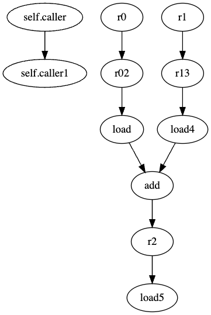

# Miniguard for Aleo

`miniguard` is a static analyzer for Aleo programs. It has built-in detectors that find vulnerabilities on Aleo programs (this also works for Leo programs if you compile them to Aleo). You can also quickly build customized vulnerability detectors or security passes using the APIs provided by `miniguard`.

## Requirements

If you want to build from source, make sure you have the following requirements satisfied:

- networkx (2.8.4+)
- pygraphviz (1.10+)
  - only required if you use `GraphGen` detector
  - you need graphviz installed as a backend first
- llvmlite (0.40.0+)
  - you probably need LLVM 13 installed as a backend first
- aleo2llvm
  - you can find it from repositories of Veridise(-Partnerships)

## Building from Docker

Alternatively, you can also run the repeatable script to automatically build in Docker. First make sure you have all the submodules fetched:

```bash
git submodule update --init --recursive
```

Then, run the following from repo root to build the image:

```bash
docker build -t miniguard-aleo .
```

You can change the default tag `miniguard-aleo` to anything else. Then run the following to initialize a container:

```bash
docker run -it --rm miniguard-aleo /bin/bash
```

This will initialize a one-time interactive shell ready to run the tool. The default path is the repo root, and you can directly try ou the commands in the *Example Usage* section.

## Usage

Note: Use `aleo2llvm` to generate a project's LLVM IR first before calling the analyzer. Check out the documentation for `aleo2llvm` for its usage.

```bash
usage: miniguard.py [-h] -p PROJECT -d DETECTOR -f FUNCTION [-v]

options:
  -h, --help            show this help message and exit
  -p PROJECT, --project PROJECT
                        path to aleo project folder
  -d DETECTOR, --detector DETECTOR
                        detectors to use, choose from: DivRD, Underflow, UnusedVar, InfoLeak, GraphGen, GraphGenTaint
  -f FUNCTION, --function FUNCTION
                        target function to analyze
  -v, --verbose
```

## Example Usage

```bash
# Detector: Division Round Down
python ./miniguard.py -d DivRD -p ./tests/benchmarks/toy-examples/adder/ -f main
python ./miniguard.py -d DivRD -p ./tests/benchmarks/workshop/basic_bank/ -f calculate_interest

# Detector: Information Leakage
python ./miniguard.py -d InfoLeak -p ./tests/benchmarks/toy-examples/adder/ -f main
python ./miniguard.py -d InfoLeak -p ./tests/benchmarks/toy-examples/conditional/ -f main
python ./miniguard.py -d InfoLeak -p ./tests/benchmarks/workshop/basic_bank/ -f calculate_interest
python ./miniguard.py -d InfoLeak -p ./tests/benchmarks/leo-examples/core/ -f main
python ./miniguard.py -d InfoLeak -p ./tests/benchmarks/veridise-examples/hash-leak/ -f main

# Detector: Unused Variable
python ./miniguard.py -d UnusedVar -p ./tests/benchmarks/veridise-examples/unused-var/ -f main

# Detector: Underflow
python ./miniguard.py -d Underflow -p ./tests/benchmarks/veridise-examples/underflow/ -f deposit
python ./miniguard.py -d Underflow -p ./tests/benchmarks/veridise-examples/underflow/ -f deposit_safe
python ./miniguard.py -d Underflow -p ./tests/benchmarks/workshop/basic_bank/ -f deposit
python ./miniguard.py -d Underflow -p ./tests/benchmarks/workshop/basic_bank/ -f withdraw.finalize

# generate information flow graph
python ./miniguard.py -d GraphGen -p ./tests/benchmarks/leo-examples/core/ -f main

# generate information flow graph for taint analysis
# this variant of graph will disconnect information flow
# between input-output pairs of hash function calls
python ./miniguard.py -d GraphGenTaint -p ./tests/benchmarks/leo-examples/core/ -f main
```

## Builtin Detectors

`miniguard` for Aleo currently supports detection of the following vulnerabilities:

### Unused Variable / Signal

```javascript
program us.aleo;

function main:
    input r0 as u64.public;
    input r1 as u64.public;
    input r2 as u64.public;
    add r0 r1 into r3;
    output r3 as u64.public;
```

In this example, variable `r2` is not used, which may indicate potential issues in functional correctness.

### Division Round Down

```javascript
closure calculate_interest:
    input r0 as u64;
    input r1 as u64;
    input r2 as u64;
    lt 0u64 r2 into r3;
    mul r0 r1 into r4;
    div r4 10000u64 into r5;
...
```

Source: `avm-benchmarks/workshop/basic_bank/main.aleo`

Division could round down to zero. Use safe math style for division-then-multiplication operation.

### Integer Subtraction Failure (Underflow)

```javascript
function deposit:
    input r0 as Token.record;
    input r1 as u64.private;
    sub r0.amount r1 into r2;
    cast r0.owner r0.gates r2 into r3 as Token.record;
    hash.bhp256 r0.owner into r4;
    output r3 as Token.record;

    finalize r4 r1;
```

Source: `avm-benchmarks/workshop/basic_bank/main.aleo`

`sub r0.amount r1 into r2` doesn't check `r0.amount >= r1`, so this could cause an "Integer Subtraction Failed" exception if `r0.amount < r1`.

### Information Leakage

```javascript
// The 'adder.aleo' program.
program adder.aleo;

function main:
    input r0 as u32.private;
    input r1 as u32.public;
    add r0 r1 into r2;
    output r2 as u32.public;
```

Vulnerable path is `r0` (private) -> `r2` (public).

## Reusable Components

Additionally, you can use `miniguard` to generate the information flow graph used in some detectors:

### Information Flow Graph

An information flow graph models the flow of information between signals/variables. For example, given the `adder` program below:

```javascript
// The 'adder.aleo' program.
program adder.aleo;

function main:
    input r0 as u32.private;
    input r1 as u32.public;
    add r0 r1 into r2;
    output r2 as u32.public;
```

it first gets compiled to LLVM IR by `aleo2llvm`:

```javascript
define i32 @main(i128 %self.caller, i32 %r0, i32 %r1) {
entry:
  %self.caller1 = alloca i128, align 8
  store i128 %self.caller, i128* %self.caller1, align 4
  %r02 = alloca i32, align 4
  store i32 %r0, i32* %r02, align 4
  %r13 = alloca i32, align 4
  store i32 %r1, i32* %r13, align 4
  br label %body

body:                                             ; preds = %entry
  %load = load i32, i32* %r02, align 4
  %load4 = load i32, i32* %r13, align 4
  %add = add i32 %load, %load4
  %r2 = alloca i32, align 4
  store i32 %add, i32* %r2, align 4
  br label %exit

exit:                                             ; preds = %body
  %load5 = load i32, i32* %r2, align 4
  ret i32 %load5
}
```

based on which we generate information flow graph as follows:



